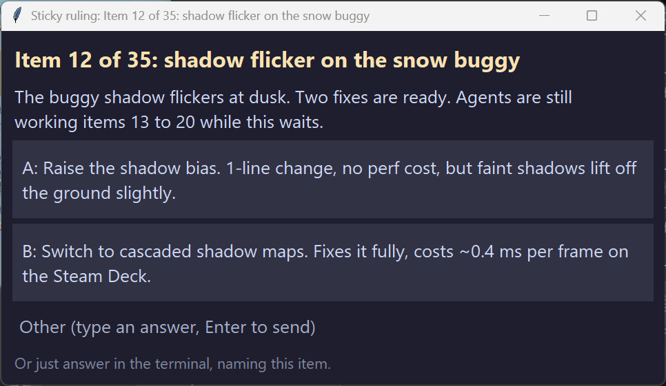

# sticky-ruling

**A Claude Code skill that keeps a decision on screen without stopping the work.**



## The problem

You're running a long Claude Code session with background agents, working through a list of 35 bugs. Claude lays out option A and option B for item 12. Then agent chatter and bash output scroll it off the screen. Ten minutes later: *"Still awaiting your ruling."* Ruling on what? The options are gone.

The built-in fix, the `AskUserQuestion` menu, pins the question, but it **freezes the whole session** until you answer. Step away for 30 minutes and you lose 30 minutes of work.

## The fix

Claude posts the ruling to a small always-on-top window and **keeps working** on everything that doesn't depend on it.

- **The full context stays visible.** The question, every option, and each trade-off sit in the window, no matter how much scrolls by in the terminal.
- **The session never stops.** The window runs as a background task. Claude moves on to the next item.
- **Answer however you like.** Click an option, type a custom answer in the window, or just reply in the terminal ("ruling 12: B"). Claude closes the window either way.
- **It never steals focus.** On Windows the window opens without taking keyboard focus, so your typing or dictation isn't interrupted.
- **Works in any terminal.** It's a separate window, so it doesn't matter whether Claude Code runs in Windows Terminal, a JetBrains IDE, or VS Code.
- **Nothing gets lost.** Several open rulings stack. The X button only minimizes. Answers are logged to `~/.claude/rulings/rulings.log`.

## Install

**As a plugin** (recommended, gets updates). Inside Claude Code:

```
/plugin marketplace add DrEvil-TitaniumHelix/sticky-ruling
/plugin install sticky-ruling@sticky-ruling
```

**Or as a plain skill:**

```
git clone https://github.com/DrEvil-TitaniumHelix/sticky-ruling ~/.claude/skills/sticky-ruling
```

Needs Python 3 with tkinter (included with the python.org Windows installer). Start a new Claude Code session and the skill appears.

## Use

Tell Claude: *"Use sticky rulings for any decision you need from me."* To make it permanent, add that line to your `CLAUDE.md`.

## How it works

Claude runs `ruling.py` through its Bash tool with `run_in_background: true`. The script opens a tkinter window and waits. A click prints `RULING <item>: <answer>` and exits, and Claude Code notifies the session that the background task finished, even if Claude was idle. For a terminal answer, Claude stops the background task, which closes the window.

## Platforms

| Platform | Status |
|---|---|
| Windows | Tested. Window never takes focus. |
| macOS, Linux | Should work (needs `python3-tk`). Untested; the window may take focus when it opens. Reports welcome. |

## Test

On Windows: `python selftest.py` opens two windows briefly and checks they appear, don't take focus, and return answers.

## License

MIT. By DrEvil ([Titanium Helix](https://github.com/DrEvil-TitaniumHelix)).
